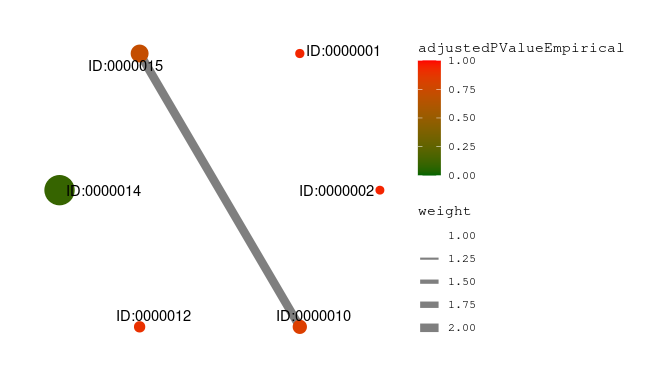
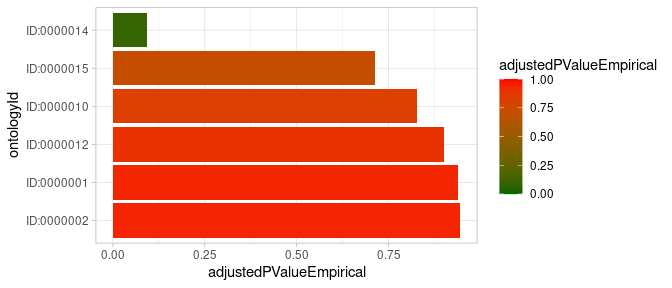
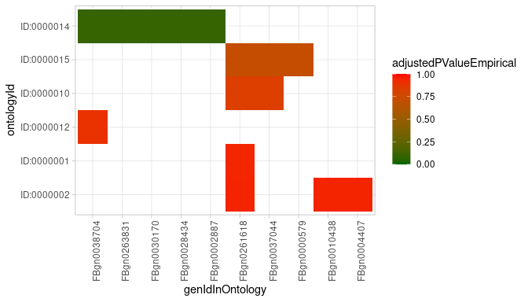

<!-- README.md is generated from README.Rmd. Please edit that file -->

# MulEA - A Tool for Multi Enrichment Analysis

## Short Description

Fast analysis of biological data which results are well interpretable
plots.

## Install Development Version

``` r
library(devtools)
install_github("https://github.com/koralgooll/MulEA.git")
```

## Example Run

Import the MulEA package and import the example data sets:

``` r
# import package
library(MulEA)

# import example gene set
# import other gene sets from a GMT file using readGmtFileAsDataFrame()
data(geneSet) 

# import "WHAT ARE WE IMPORTING HERE?"
data(selectDf)

# import "WHAT ARE WE IMPORTING HERE?"
data(poolDf)
```

## Set Based Test

Define an S4 object of class `ORA` (stands for Over-Representation
Analysis), run set based tests (hypergeometric test with empirical
p-value adjustment) and reshape results:

``` r
ora_model <- ORA(
  gmt = geneSet,
  testData = selectDf$select, 
  pool = poolDf$pool,
  adjustMethod = "PT",
  number_of_permutations = 1000
)

ora_results <- run_test(ora_model)

ora_reshaped_results <- reshape_results(
  model = ora_model, 
  model_results = ora_results, 
  p_value_type_colname='adjustedPValueEmpirical'
)
```

View results:

``` r
View(ora_results)
```

Plot results:

``` r
plot_graph(
  reshaped_results=ora_reshaped_results,
  p_value_max_threshold = 1.00,
  p_value_type_colname = "adjustedPValueEmpirical"
)
```



``` r
plot_barplot(
  reshaped_results = ora_reshaped_results,
  p_value_max_threshold=1.00,
  p_value_type_colname = "adjustedPValueEmpirical"
)
```



``` r
plot_heatmap(
  reshaped_results=ora_reshaped_results,
  p_value_max_threshold=1.00,
  p_value_type_colname = 'adjustedPValueEmpirical'
)
```



## Ranked Based Test

Define an S4 object of class `RankedBasedTest`, run ranked based test
(Subramanian method) and reshape results:

``` r
ranked_model <- GSEA(
  gmt = geneSet,
  testData = selectDf$select,
  element_scores = selectDf$score
)

ranked_results <- run_test(ranked_model)

ranked_reshaped_results <- reshape_results(
  model = ranked_model, 
  model_results = ranked_results, 
  ontology_id_colname='ontologyId'
)
```

View results:

``` r
View(ranked_results)
```

Plot results:

``` r
# TODO FIX ERROR: Wrongly set data column names
plot_graph(
  reshaped_results=ranked_results,
  p_value_max_threshold = 1.00
)

plot_barplot(
  reshaped_results = ranked_results,
  p_value_max_threshold=1.00
)

plot_heatmap(
  reshaped_results=mulea_sub_reshaped_results,
  p_value_max_threshold=1.00
)
```

# Detailed Description

Functional interpretation of the biological data typically involves
identifying key genes, molecules, reactions or pathways by finding
non-random changes between two or more conditions or phenotype.
Performing enrichment analysis on set of molecules selected from
differential omics analysis is a method of choice. Among many packages
that can be applied for this task, only few could be applied either to
multiple species, ontology types or providing an access to multiple
statistics.

MulEA is addressing this gap in addition providing improved way to
calculate correction for multiple testing that assume partial dependence
between ontology terms and in result limits number of correct
associations falsely scored as insignificant. Besides the commonly
applied tests, MulEA provides a unique permutation based, empirical
false discovery rate correction of the p-values to substitute the too
conservative Bonferroni and Benjamini-Hochberg procedures.

MulEA allows enrichment analysis using most popular gene and pathway
ontologies (GO, KEGG, Reactome). In addition, one can test enrichment in
genomic locations and in gene expression, protein domain, miRNA and
transcription factors data bases, all created from publicly available
resources and presented in standardized manner. Beyond genes or
proteins, MulEA even allows working with basically any kind of data
types, i.e. small molecules, chromosome region, enhancers, molecular
interactions or any other information defined by the user.

Mulea currently supports 25 organisms from bacteria to human. Because,
in addition to knowledge-bases provided alongside the package, the user
may provide its own ontology files, MulEA can work with any biological
species.

To analyse the data MulEA provide multiple types of statistics in one
tool, which allows the user to calculate over-representations using the
hypergeometric test, and enrichment analyses of ranked input by the
Kolmogorov-Smirnov test.

To conclude, MulEA is a comprehensive enrichment software that allows
expansive analyses using diverse ontologies, statistical models and
p-value correction procedures that can extend our understanding of the
results of various high-throughput analyses and therefore expand our
knowledge.

An R-package for fast analysis of bioligical data. The package
implements three different approaches of this type of analysis. This
file include blueprint of package possibilities, to see more …
