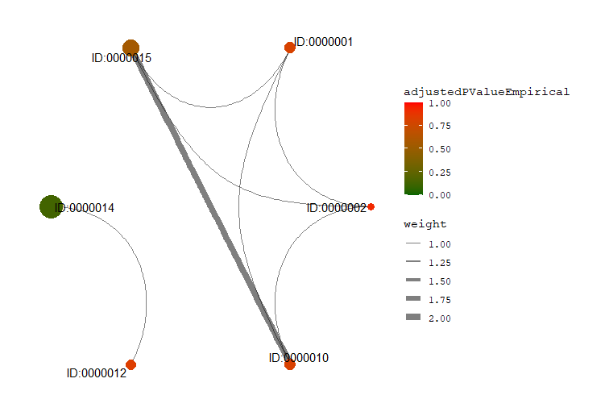
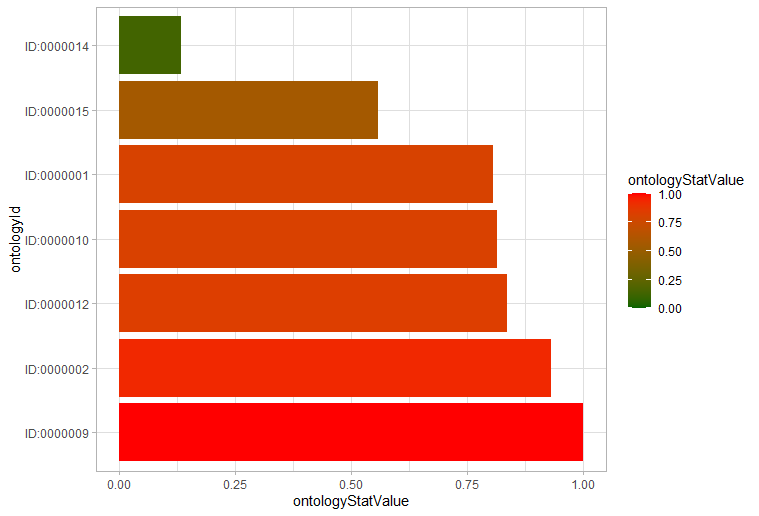
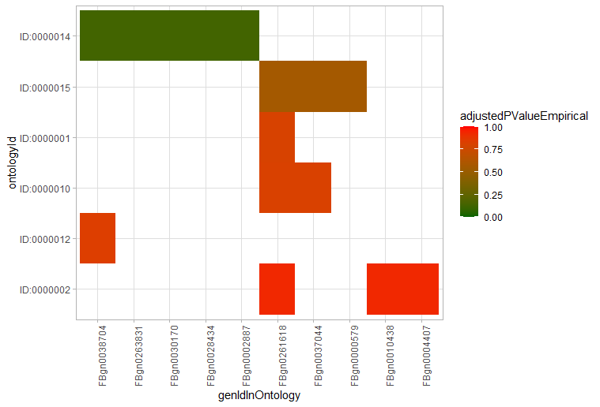
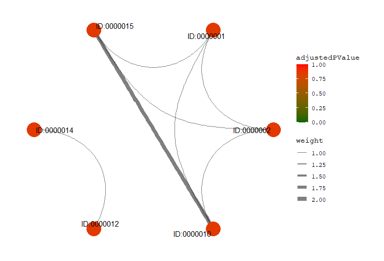
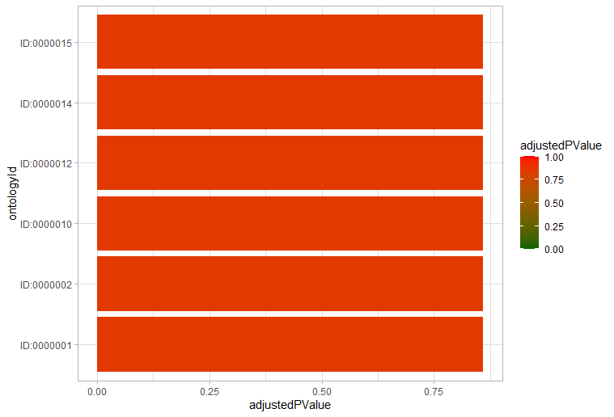
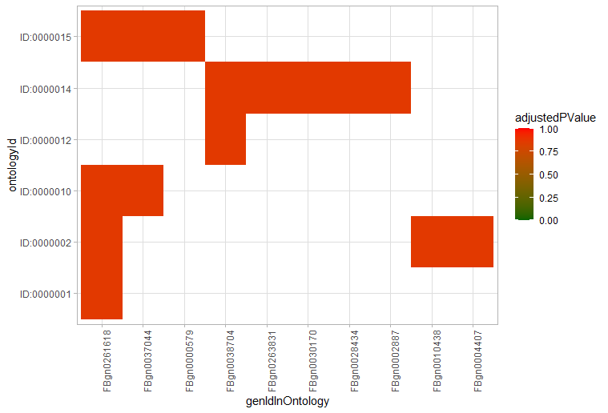
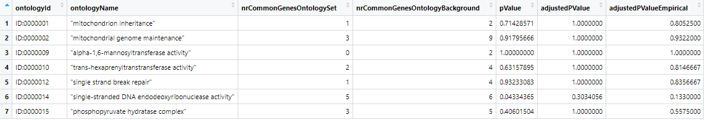
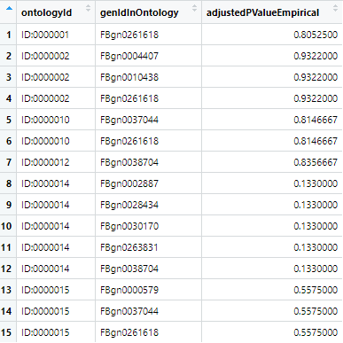

# MulEA - A Tool for Multi Enrichment Analysis


# Short Description
Fast analysis of biological data which results are well interpretable plots. 


## Installation

```{r}
# TODO : install.packages('pathToReleaseOnGithub')
```


## Example Run

Loading libraries and loading example input data:

```{r}
library(MulEA)
muleaPkgDir <- find.package("MulEA")
modelDfFromFile <- MulEA::readGmtFileAsDataFrame(
    gmtFilePath = paste(muleaPkgDir,"/extdata/model.gmt", sep = ""))
selectDf <- read.csv2(file = './inst/extdata/selectData.csv')
select <- selectDf[['select']]
poolDf <- read.csv2(file = './inst/extdata/poolData.csv')
pool <- poolDf[['pool']]
number_of_steps <- 1000
```

Running MulEA (two from few implemented approaches):

- Set based tests represented by `ORA` class (classic hypergeometric test with empirical p-value adjustment):

```{r}
mulea_ora_model <- MulEA::ORA(
    gmt = modelDfFromFile, testData = select, 
    pool = pool, adjustMethod = "PT",
    numberOfPermutations = number_of_steps)
mulea_ora_results <- MulEA::runTest(mulea_ora_model)
mulea_ora_detailed_results <- MulEA::createDetailedResults(
    mulea_model=mulea_ora_model, 
    mulea_model_resuts=mulea_ora_results, 
    category_stat_column_name='adjustedPValueEmpirical')
```

- Ranked based tests represented by `RankedBasedTest` class (Subramanian method):

```{r}
selectScores <- selectDf[['score']]
mulea_ranked_model <- MulEA::RankedBasedTest(
    method = "Subramanian", gmt = modelDfFromFile, 
    testData = select, scores = selectScores)
mulea_sub_results <- MulEA::runTest(mulea_ranked_model)
mulea_sub_detailed_results <- MulEA::createDetailedResults(
    mulea_model = mulea_ranked_model, 
    mulea_model_resuts = mulea_sub_results, 
    mulea_model_resuts_ontology_col_name='ontologyId')
```


## Results

```{r}
MulEA::plotGraph(mulea_relaxed_resuts=mulea_ora_detailed_results, statistics_value_cutoff = 1.00)
MulEA::plotBarplot(mulea_relaxed_resuts = mulea_ora_detailed_results, statistics_value_cutoff=1.00)
MulEA::plotHeatmap(mulea_relaxed_resuts=mulea_ora_detailed_results, statistics_value_cutoff=1.00)
```

<table style="padding:10px">
  <tr>
    <td></td>
    <td></td>
    <td>></td>
  </tr>
</table>

```{r}
MulEA::plotGraph(mulea_relaxed_resuts=mulea_sub_detailed_results, statistics_value_cutoff = 1.00)
MulEA::plotBarplot(mulea_relaxed_resuts = mulea_sub_detailed_results, statistics_value_cutoff=1.00)
MulEA::plotHeatmap(mulea_relaxed_resuts=mulea_sub_detailed_results, statistics_value_cutoff=1.00)
```

<table style="padding:10px">
  <tr>
    <td></td>
    <td></td>
    <td>></td>
  </tr>
</table>

Example of results in data.frame form:

<table style="padding:10px">
  <tr>
    <td></td>
  </tr>
  <tr>
    <td></td>
  </tr>
</table>


# Detailed Description
Functional interpretation of the biological data typically involves identifying key genes, molecules, reactions or pathways by finding non-random changes between two or more conditions or phenotype. Performing enrichment analysis on set of molecules selected from  differential omics analysis is a method of choice. Among many packages that can be applied for this task, only few could be applied either to multiple species, ontology types or providing an access to multiple statistics.

MulEA is addressing this gap in addition providing improved way to calculate correction for multiple testing that assume partial dependence between ontology terms and in result limits number of correct associations falsely scored as insignificant. Besides the commonly applied tests, MulEA provides a unique permutation based, empirical false discovery rate correction of the p-values to substitute the too conservative Bonferroni and Benjamini-Hochberg procedures.

MulEA allows enrichment analysis using most popular gene and pathway ontologies (GO, KEGG, Reactome). In addition, one can test enrichment in genomic locations and in gene expression, protein domain, miRNA and transcription factors data bases, all created from publicly available resources and presented in standardized manner. Beyond genes or proteins, MulEA even allows working with basically any kind of data types, i.e. small molecules, chromosome region, enhancers, molecular interactions or any other information defined by the user.

Mulea currently supports 25 organisms from bacteria to human. Because, in addition to knowledge-bases provided alongside the package, the user may provide its own ontology files, MulEA can work with any biological species.

To analyse the data MulEA provide multiple types of statistics in one tool, which allows the user to calculate over-representations using the hypergeometric test, and enrichment analyses of ranked input by the Kolmogorov-Smirnov test.
                   
To conclude, MulEA is a comprehensive enrichment software that allows expansive analyses using diverse ontologies, statistical models and p-value correction procedures that can extend our understanding of the results of various high-throughput analyses and therefore expand our knowledge.

An R-package for fast analysis of bioligical data. The package implements three different approaches of this type of analysis. This file include blueprint of package possibilities, to see more ... 

