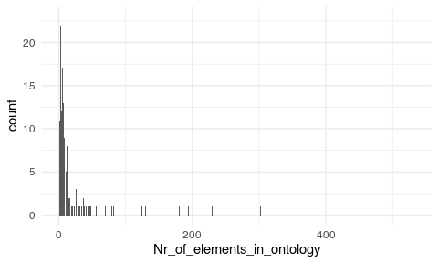
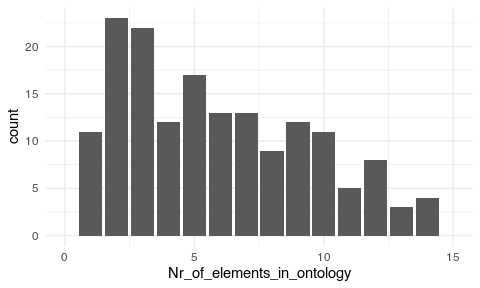
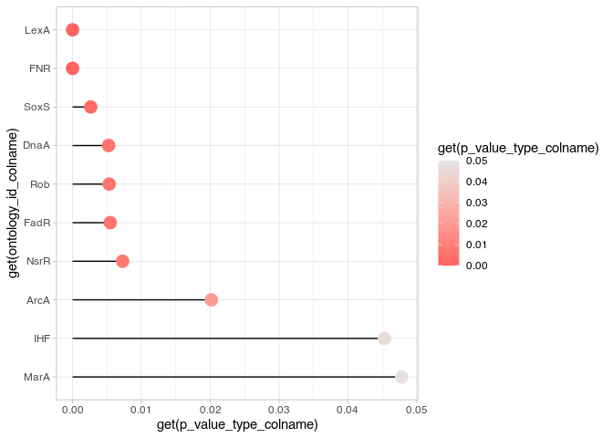
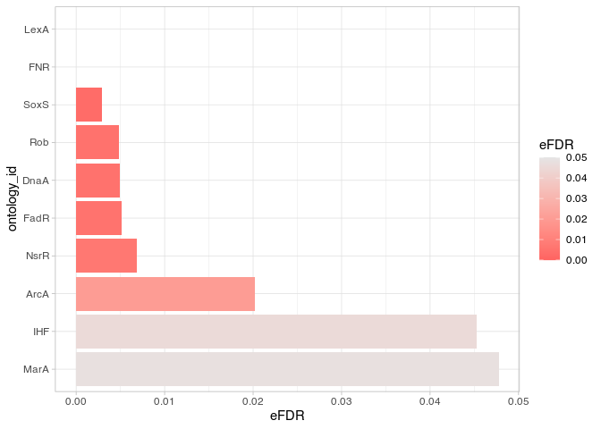
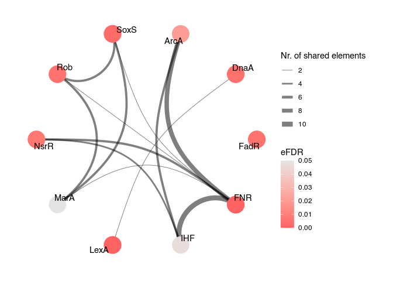
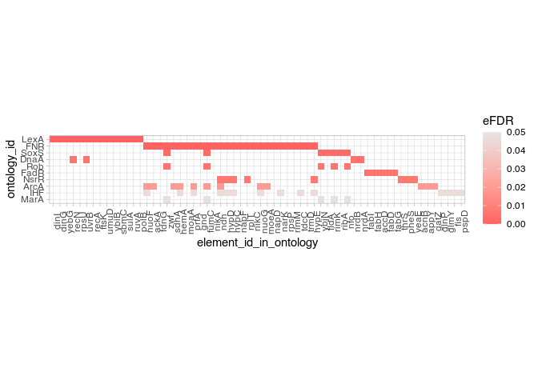
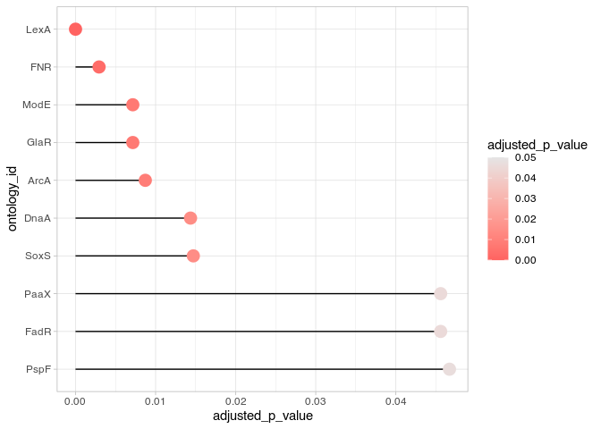
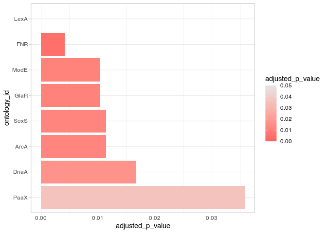
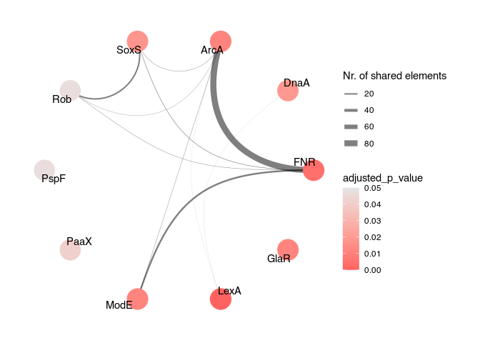
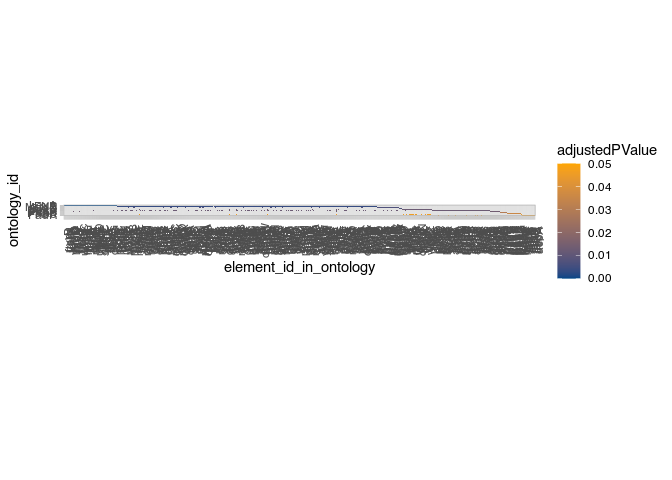

<!-- README.md is generated from README.Rmd. Please edit that file -->

#  `mulea` - an R Package for Enrichment Analysis Using Multiple Ontologies and Empirical FDR Correction

<!-- badges: start -->

[](https://github.com/ELTEbioinformatics/mulea/issues)
[](https://github.com/ELTEbioinformatics/mulea/pulls)

<!-- badges: end -->

- [Introduction](#introduction)
- [Installation](#installation)
- [Example Usage](#example-usage)
  - [Formatting the Differential Expression
    Results](#formatting-the-differential-expression-results)
  - [The Gene Set for Identifying Regulatory Transcription
    Factors](#the-gene-set-for-identifying-regulatory-transcription-factors)
  - [OverRepresentation Analysis
    (ORA)](#overrepresentation-analysis-ora)
  - [Gene Set Enrichment Analysis
    (GSEA)](#gene-set-enrichment-analysis-gsea)
- [Session Info](#session-info)
- [References](#references)
- [How to Cite the `mulea` Package?](#how-to-cite-the-mulea-package)
- [Code of Conduct](#code-of-conduct)


# Introduction

Traditional gene set enrichment analyses are typically limited to a few
ontologies and do not account for the interdependence of gene sets or
terms, resulting in overcorrected *p*-values. To address these
challenges, we introduce `mulea`, an R package offering comprehensive
overrepresentation and functional enrichment analysis.

`mulea` employs an innovative empirical *false discovery rate* (*eFDR*)
correction method, specifically designed for interconnected biological
data, to accurately identify significant terms within diverse
ontologies. Beyond conventional tools, `mulea` incorporates a wide range
of ontologies encompassing Gene Ontology, pathways, regulatory elements,
genomic locations, and protein domains. This flexibility empowers
researchers to tailor enrichment analysis to their specific questions,
such as identifying enriched transcriptional regulators in gene
expression data or overrepresented protein domains in protein sets.

To facilitate seamless analysis, `mulea` provides gene sets (in
standardized GMT format) for 27 model organisms, covering 16 databases
and various identifiers. The GMT files and the scripts we applied to
create them are available at the
[GMT_files_for_mulea](https://github.com/ELTEbioinformatics/GMT_files_for_mulea)
repository. Additionally, the
[`muleaData`](https://github.com/ELTEbioinformatics/muleaData)
ExperimentData Bioconductor R package simplifies access to these 879
pre-defined ontologies. Furthermore, `mulea`’s architecture allows for
easy integration of user-defined ontologies, expanding its applicability
across diverse research areas.

# Installation

After installing the `BiocManager` package, you can install
[`fgsea`](https://bioconductor.org/packages/release/bioc/html/fgsea.html),
a dependency for `mulea` from Bioconductor. Then, you can install
`mulea` from this github repo using the `install_github` function of the
`devtools` package:

``` r
# installing the BiocManager package if needed
if (!require("BiocManager", quietly = TRUE))
    install.packages("BiocManager")

# installing the fgsea package from Bioconductor
BiocManager::install("fgsea")

# installing the devtools package if needed
if (!require("devtools", quietly = TRUE))
    install.packages("devtools")

# installing the mulea package from GitHub
devtools::install_github("https://github.com/ELTEbioinformatics/mulea")
```

# Example Usage

## Formatting the Differential Expression Results

This section demonstrates how to use `mulea` with a sample dataset. If
you have your own data, feel free to skip this part and proceed directly
to the [OverRepresentation Analysis
(ORA)](#overrepresentation-analysis-ora) or [Gene Set Enrichment
Analysis (GSEA)](#gene-set-enrichment-analysis-gsea) sections.

### **1. Downloading and Exploring the Dataset:**

This example analyses a differential expression (DE) dataset from a
microarray experiment deposited in the NCBI Gene Expression Omnibus
 under
accession number
[GSE55662](https://www.ncbi.nlm.nih.gov/geo/query/acc.cgi?acc=GSE55662).
The original study by [Méhi *et al.*
(2014)](https://doi.org/10.1093/molbev/msu223), investigated the
evolution of antibiotic resistance in *Escherichia coli* bacteria. The
authors compared gene expression changes in *ciprofloxacin*-treated
bacteria to non-treated controls.

The [GEO2R](https://www.ncbi.nlm.nih.gov/geo/geo2r/?acc=GSE55662) tool
was used for differential expression analysis, comparing:

- Non-treated control samples (2 replicates)
- Samples treated with *ciprofloxacin* (2 replicates)

### **2. Reading the DE Results Table:**

This section would typically describe the format and key elements of the
provided DE results table, guiding users on how to interpret the data
for further analysis with `mulea`.

``` r
library(tidyverse)
geo2r_result_tab <- read_tsv("GSE55662.table_wt_non_vs_cipro.tsv")
```

### **3. Examining the Data:**

We take a closer look at the first few rows of the `geo2r_result_tab`
data frame:

| ID           | adj.P.Val | P.Value |    t |       B | logFC | Gene.symbol                  | Gene.title                                                                                                            |
|:-------------|----------:|--------:|-----:|--------:|------:|:-----------------------------|:----------------------------------------------------------------------------------------------------------------------|
| 1765336_s_at |    0.0186 | 2.4e-06 | 21.5 | 4.95769 |  3.70 | gnsB                         | Qin prophage; multicopy suppressor of secG(Cs) and fabA6(Ts)                                                          |
| 1760422_s_at |    0.0186 | 3.8e-06 | 19.6 | 4.68510 |  3.14 | NA                           | NA                                                                                                                    |
| 1764904_s_at |    0.0186 | 5.7e-06 | 18.2 | 4.43751 |  2.54 | sulA///sulA///sulA///ECs1042 | SOS cell division inhibitor///SOS cell division inhibitor///SOS cell division inhibitor///SOS cell division inhibitor |

### **4. Data Formatting:**

It’s important to format the data frame appropriately for enrichment
analysis. This process often involves steps specific to the type of
microarray experiment conducted. In this case, we perform the following
transformations:

- **Extract Gene Symbol:** We extract the main gene symbol from the
  `Gene.symbol` column, removing any additional information that might
  be present.
- **Remove Missing Values:** We remove rows where the gene symbol is
  missing (`NA`).
- **Order by Fold Change:** We sort the data frame by the log-fold
  change (`logFC`) in descending order, prioritizing genes with the most
  significant expression changes.

``` r
geo2r_result_tab %<>% 
  # extracting the first gene symbol from the Gene.symbol column
  mutate(Gene.symbol = str_remove(string = Gene.symbol,
                                  pattern = "\\/.*")) %>% 
  # removing rows where Gene.symbol is NA
  filter(!is.na(Gene.symbol)) %>% 
  # ordering by logFC
  arrange(desc(logFC))
```

Before proceeding with enrichment analysis, we take a closer look at the
first few rows of the formatted `geo2r_result_tab` data frame:

| ID           | adj.P.Val |  P.Value |    t |       B | logFC | Gene.symbol | Gene.title                                                                                                                                |
|:-------------|----------:|---------:|-----:|--------:|------:|:------------|:------------------------------------------------------------------------------------------------------------------------------------------|
| 1765336_s_at |    0.0186 | 2.40e-06 | 21.5 | 4.95769 |  3.70 | gnsB        | Qin prophage; multicopy suppressor of secG(Cs) and fabA6(Ts)                                                                              |
| 1764904_s_at |    0.0186 | 5.70e-06 | 18.2 | 4.43751 |  2.54 | sulA        | SOS cell division inhibitor///SOS cell division inhibitor///SOS cell division inhibitor///SOS cell division inhibitor                     |
| 1761763_s_at |    0.0186 | 1.54e-05 | 15.0 | 3.73568 |  2.16 | recN        | recombination and repair protein///recombination and repair protein///recombination and repair protein///recombination and repair protein |

After applying these formatting steps, the data frame is ready for
further analysis.

## The Gene Set for Identifying Regulatory Transcription Factors

This section explores the transcription factors influencing the
significantly overexpressed genes. We employed the `mulea` package to
conduct multiple enrichment analyses using the
 [database](https://regulondb.ccg.unam.mx/).

The analysis utilized a GMT file downloaded from the dedicated
[GMT_files_for_mulea](https://github.com/ELTEbioinformatics/GMT_files_for_mulea)
GitHub repository. This file associates gene symbols with the
transcription factors that regulate them.

The GMT file contains lists of gene symbols regulated by specific
transcription factors, also identified by gene symbols within the file.
We proceed to parse and analyse this data to uncover the regulatory
relationships.

### 1. Downloading and Parsing the GMT File:

We can download the required GMT file from the repository using the
website and then read the file. For this we need to call the `mulea`
package.

``` r
library(mulea)
tf_gmt <- read_gmt("Transcription_factor_RegulonDB_Escherichia_coli_GeneSymbol.gmt")
```

**Or** we can read it directly from the GitHub repo:

``` r
library(mulea)
tf_gmt <- read_gmt("https://raw.githubusercontent.com/ELTEbioinformatics/GMT_files_for_mulea/main/GMT_files/Escherichia_coli_83333/Transcription_factor_RegulonDB_Escherichia_coli_GeneSymbol.gmt")
```

### 2. Let’s Check Some Properties of the `tf_gmt`:

How many transcription factors it contains?

``` r
nrow(tf_gmt)
#> [1] 211
```

The first 3 rows of the `tf_gmt`:

| ontology_id | ontology_name | list_of_values |
|:------------|:--------------|:---------------|
| AccB        | AccB          | accC, accB     |
| AcrR        | AcrR          | marB, ma….     |
| Ada         | Ada           | alkB, ad….     |

**Important Note:** The format of this GMT differs slightly from
standard GMT files. In the `tf_gmt`, both the `ontology_id` and
`ontology_name` columns contain gene symbols of the transcription
factors, unlike other GMT files like GO, where these columns hold
specific identifiers and corresponding names.

Each line in the file represents a group of genes regulated by a
specific transcription factor. The `list_of_values` column lists the
gene symbols under the control of the transcription factor mentioned in
the `ontology_id` column.

For example, to see all genes regulated by the transcription factor
“AcrR”, you can use the following code:

``` r
tf_gmt %>% 
  # filtering the row where the ontology_id is AcrR
  filter(ontology_id == "AcrR") %>% 
  # selecting the list_of_values column
  select(list_of_values) %>% 
  # converting tibble to vector
  pull()
#> [[1]]
#>  [1] "marB" "marR" "marA" "acrB" "micF" "flhD" "acrR" "flhC" "acrA" "soxS"
#> [11] "soxR"
```

### 3. Focusing on Relevant Entries for the Enrichment Analysis

Enrichment analysis results can sometimes be skewed by overly specific
or broad entries. `mulea` allows you to customize the size of ontology
entries, ensuring your analysis aligns with your desired scope.

**Analysing Entry Distribution:**

Let’s examine the distribution of the number of gene symbols in the
`list_of_values` column to identify entries requiring exclusion:

``` r
Nr_of_elements_in_ontology <- tf_gmt$list_of_values %>% 
  map_dbl(length)
ggplot(mapping = aes(Nr_of_elements_in_ontology)) + 
  geom_bar() +
  theme_minimal()
```



This plot reveals entries containing over 200 gene symbols, indicating
these transcription factors regulate too many genes, making them overly
broad. We’ll exclude them from the analysis.

Conversely, some entries hold a very small number of elements. Let’s
zoom in:

``` r
ggplot(mapping = aes(Nr_of_elements_in_ontology)) + 
  geom_bar() +
  xlim(0, 15) +
  theme_minimal()
```



**Filtering Entries:**

Based on our observations, we’ll exclude entries with less than 3 or
more than 400 gene symbols. Let’s check the remaining number of
transcription factors:

``` r
tf_gmt_filtered <- filter_ontology(gmt = tf_gmt,
                                   min_nr_of_elements = 3,
                                   max_nr_of_elements = 400)
```

**Results:**

We can now determine the number of transcription factors remaining in
the filtered dataset:

``` r
nrow(tf_gmt_filtered)
#> [1] 154
```

It is possible to write the filtered ontology as a GMT file using the
`write_gmt` function.

``` r
write_gmt(gmt = tf_gmt_filtered, 
          file = "Filtered.gmt")
```

### Converting a List to an Ontology Object

The `mulea` package provides a function to convert a list of gene sets
to an ontology (GMT) object. This function is called `list_to_gmt`. The
following example demonstrates how to use this function:

``` r
# creating a list of gene sets
ontology_list <- list(gene_set1 = c("gene1", "gene2", "gene3"),
                      gene_set2 = c("gene4", "gene5", "gene6"))

# converting the list to a ontology (GMT) object
new_ontology_object <- list_to_gmt(ontology_list)
```

## OverRepresentation Analysis (ORA)

This approach analyses groups of genes (sets) to identify if they are
enriched in specific categories – transcription factors – within a
reference set. It requires two key elements:

1.  **Target set:** This contains genes of interest, such as
    significantly overexpressed genes in our experiment.

2.  **Background set:** This represents the broader context, often
    including all genes investigated in our study.

To ensure meaningful results, a clear threshold needs to be applied
beforehand. This could involve filtering genes based on corrected
*p*-values, *z*-scores (commonly set at 0.05), or fold-change values
(*e.g.*, a minimum 2-fold change).

`mulea` utilizes the hypergeometric test to assess overrepresentation
within categories. This test is similar to the lower-tailed Fisher’s
exact test and helps determine if the observed enrichment is
statistically significant by considering both the target and background
sets.

### Preparing the Target set

A vector containing the gene symbols of significantly overexpressed
(adjusted *p*-value \< 0.05) genes with greater than 2 fold-change
(logFC \> 1).

``` r
sign_genes <- geo2r_result_tab %>% 
  # filtering for adjusted p-value < 0.05 and logFC > 1
  filter(adj.P.Val < 0.05 & logFC > 1) %>% 
  # selecting the Gene.symbol column
  select(Gene.symbol) %>% 
  # converting the tibble to a vector
  pull() %>% 
  # removing duplicates
  unique()
```

The first 10 elements of the target set:

``` r
sign_genes %>% 
  head(10)
#>  [1] "gnsB"    "sulA"    "recN"    "c4435"   "dinI"    "c2757"   "c1431"  
#>  [8] "gabP"    "recA"    "ECs5456"
```

The number of genes in the target set:

``` r
sign_genes %>% 
  length()
#> [1] 241
```

### Preparing the Background Set

A vector containing the gene symbols of all genes were included in the
differential expression analysis.

``` r
background_genes <- geo2r_result_tab %>% 
  # selecting the Gene.symbol column
  select(Gene.symbol) %>% 
  # convertin the tibble to a vector
  pull() %>% 
  # removing duplicates
  unique()
```

The number of genes in the background set:

``` r
background_genes %>% 
  length()
#> [1] 7381
```

### Performing the OverRepresentation Analysis

To perform the analysis, we will first establish a model using the `ora`
function. This model defines the parameters for the enrichment analysis.
Subsequently, we will execute the test itself using the `run_test`
function. It is important to note that for this example, we will employ
10,000 permutations for the *empirical false discovery rate* correction,
which is the recommended minimum, to ensure robust correction for
multiple testing.

``` r
# creating the ORA model using the GMT variable
ora_model <- ora(gmt = tf_gmt_filtered, 
                 # the test set variable
                 element_names = sign_genes, 
                 # the background set variable
                 background_element_names = background_genes, 
                 # the p-value adjustment method
                 p_value_adjustment_method = "eFDR", 
                 # the number of permutations
                 number_of_permutations = 10000,
                 # the number of processor threads to use
                 nthreads = 2) 
# running the ORA
ora_results <- run_test(ora_model)
```

### Examining the ORA Result

The `ora_results` data frame summarizes the enrichment analysis, listing
enriched ontology entries – in our case transcription factors –
alongside their associated *p*-values and *empirical FDR* values. We can
now determine the number of transcription factors classified as
“enriched” based on these statistical measures (*eFDR* \< 0.05).

``` r
ora_results %>%
  # rows where the eFDR < 0.05
  filter(eFDR < 0.05) %>% 
  # the number of such rows
  nrow()
#> [1] 10
```

And inspect the significant results:

``` r
ora_results %>%
  # arrange the rows by the eFDR values
  arrange(eFDR) %>% 
  # rows where the eFDR < 0.05
  filter(eFDR < 0.05)
```

| ontology_id | ontology_name | nr_common_with_tested_elements | nr_common_with_background_elements |   p_value |      eFDR |
|:------------|:--------------|-------------------------------:|-----------------------------------:|----------:|----------:|
| FNR         | FNR           |                             26 |                                259 | 0.0000003 | 0.0000000 |
| LexA        | LexA          |                             14 |                                 53 | 0.0000000 | 0.0000000 |
| SoxS        | SoxS          |                              7 |                                 37 | 0.0001615 | 0.0028667 |
| DnaA        | DnaA          |                              4 |                                 13 | 0.0006281 | 0.0048167 |
| Rob         | Rob           |                              5 |                                 21 | 0.0004717 | 0.0050200 |
| FadR        | FadR          |                              5 |                                 20 | 0.0003692 | 0.0051000 |
| NsrR        | NsrR          |                              8 |                                 64 | 0.0010478 | 0.0067000 |
| ArcA        | ArcA          |                             12 |                                148 | 0.0032001 | 0.0196375 |
| IHF         | IHF           |                             14 |                                205 | 0.0070758 | 0.0443800 |
| MarA        | MarA          |                              5 |                                 37 | 0.0066068 | 0.0468111 |

### Visualizing the ORA Result

For a more comprehensive understanding of the enriched transcription
factors, `mulea` provides diverse visualization tools, including
lollipop charts, networks, and heatmaps. These visualizations can
effectively reveal patterns and relationships among the enriched
factors.

Initializing the visualization with the `reshape_results` function:

``` r
ora_reshaped_results <- reshape_results(model = ora_model, 
                                        model_results = ora_results, 
                                        # choosing which column to use for the
                                        # indication of significance
                                        p_value_type_colname = "eFDR")
```

**Visualizing the spread of *eFDR* values: Lollipop plot**

Lollipop charts offer a graphical representation of the distribution of
enriched transcription factors. The *y*-axis displays the transcription
factors, while the *x*-axis represents their corresponding *eFDR*
values. The dots are is coloured based on their significance level. This
visualization helps us examine the spread of *eFDR*s and identify
factors exceeding the commonly used significance threshold of 0.05.

``` r
plot_lollipop(reshaped_results = ora_reshaped_results,
              # the column containing the names we wish to plot
              ontology_id_colname = "ontology_id",
              # upper threshold for the value indicating the significance
              p_value_max_threshold = 0.05,
              # column that indicates the significance values
              p_value_type_colname = "eFDR")
```



**Visualizing the spread of *eFDR* values: Bar plot**

Bar charts offer very similar graphical representation of the
distribution of enriched transcription factors as the lollipop plot. The
*y*-axis displays the transcription factors, while the *x*-axis
represents their corresponding *eFDR* values. The bars are is coloured
based on their significance level. This visualization helps us examine
the spread of *eFDR*s and identify factors exceeding the commonly used
significance threshold of 0.05.

``` r
plot_barplot(reshaped_results = ora_reshaped_results,
              # the column containing the names we wish to plot
              ontology_id_colname = "ontology_id",
              # upper threshold for the value indicating the significance
              p_value_max_threshold = 0.05,
              # column that indicates the significance values
              p_value_type_colname = "eFDR")
```



**Visualizing Relationships: Network Plot**

This function generates a network visualization of the enriched
transcription factors. Each node represents a transcription factor and
is coloured based on its significance level. A connection (edge) is
drawn between two nodes if they share at least one common gene belonging
to the **target set**, meaning that both transcription factors regulate
the expression of the same target gene. The thickness of the edge
reflects the number of shared genes belonging to the **target set**.

``` r
plot_graph(reshaped_results = ora_reshaped_results,
           # the column containing the names we wish to plot
           ontology_id_colname = "ontology_id",
           # upper threshold for the value indicating the significance
           p_value_max_threshold = 0.05,
           # column that indicates the significance values
           p_value_type_colname = "eFDR")
```



**Heatmap**

The heatmap displays the genes associated with the enriched
transcription factors. Each row represents a transcription factor and is
coloured based on its significance level. Each column represents a
target gene belonging to the **target set** that is potentially
regulated by one or more of the enriched transcription factors.

``` r
plot_heatmap(reshaped_results = ora_reshaped_results,
             # the column containing the names we wish to plot
             ontology_id_colname = "ontology_id",
             # column that indicates the significance values
             p_value_type_colname = "eFDR")
```



## Gene Set Enrichment Analysis (GSEA)

To perform enrichment analysis using ranked lists, you need to provide
an ordered list of elements, such as genes, transcripts, or proteins.
This ranking is typically determined by the results of your prior
analysis, potentially based on factors like *p*-values, *z*-scores,
fold-changes, or others. Crucially, the ranked list should include all
elements involved in your analysis. For instance, in a differential
expression study, it should encompass all genes that were measured.

`mulea` utilizes the Kolmogorov-Smirnov approach with a permutation test
(developed by (Subramanian et al. 2005)) to calculate gene set
enrichment analyses. This functionality is implemented through the
integration of the
[`fgsea`](https://bioconductor.org/packages/release/bioc/html/fgsea.html)
Bioconductor R package (created by (Korotkevich et al. 2021)).

GSEA requires input data about the genes analysed in our experiment.
This data can be formatted in two ways:

1.  **Data frame:** This format should include all genes investigated
    and their respective log fold change values (or other values for
    ordering the genes) obtained from the differential expression
    analysis.

2.  **Two vectors:** Alternatively, you can provide two separate
    vectors. One vector should contain the gene symbols (or IDs), and
    the other should hold the corresponding log fold change values (or
    other values for ordering the genes) for each gene.

### Preparing the data frame input for the GSEA

``` r
# if there are duplicated Gene.symbols keep the first one only
geo2r_result_tab_filtered <- geo2r_result_tab %>% 
  # grouping by Gene.symbol to be able to filter
  group_by(Gene.symbol) %>%
  # keeping the first row for each Gene.symbol from rows with the same 
  # Gene.symbol
  filter(row_number()==1) %>% 
  # ungrouping
  ungroup() %>% 
  # arranging by logFC in descending order
  arrange(desc(logFC)) %>%
  select(Gene.symbol, logFC)
```

The number of gene symbols in the `geo2r_result_tab_filtered` vector:

``` r
geo2r_result_tab_filtered %>% 
  nrow()
#> [1] 7381
```

### Performing the Gene Set Enrichment Analysis

To perform the analysis, we will first establish a model using the
`gsea` function. This model defines the parameters for the enrichment
analysis. Subsequently, we will execute the test itself using the
`run_test` function. We will employ 10,000 permutations for the false
discovery rate correction, to ensure robust correction for multiple
testing.

``` r
# creating the GSEA model using the GMT variable
gsea_model <- gsea(gmt = tf_gmt_filtered,
                   # the names of elements to test
                   element_names = geo2r_result_tab_filtered$Gene.symbol,
                   # the logFC-s of elements to test
                   element_scores = geo2r_result_tab_filtered$logFC,
                   # consider elements having positive logFC values only
                   element_score_type = "pos",
                   # the number of permutations
                   number_of_permutations = 10000)
# running the GSEA
gsea_results <- run_test(gsea_model)
```

### Examining the GSEA Results

The `gsea_results` data frame summarizes the enrichment analysis,
listing enriched ontology entries – in our case transcription factors –
alongside their associated *p*-values and adjusted *p*-value values. We
can now determine the number of transcription factors classified as
“enriched” based on these statistical measures (adjusted *p*-value \<
0.05).

``` r
gsea_results %>%
  # rows where the adjusted_p_value < 0.05
  filter(adjusted_p_value < 0.05) %>% 
  # the number of such rows
  nrow()
#> [1] 9
```

And inspect the significant results:

``` r
gsea_results %>%
  # arrange the rows by the adjusted_p_value values
  arrange(adjusted_p_value) %>% 
  # rows where the adjusted_p_value < 0.05
  filter(adjusted_p_value < 0.05)
```

| ontology_id | ontology_name | nr_common_with_tested_elements |   p_value | adjusted_p_value |
|:------------|:--------------|-------------------------------:|----------:|-----------------:|
| LexA        | LexA          |                             53 | 0.0000000 |        0.0000018 |
| FNR         | FNR           |                            259 | 0.0000373 |        0.0028553 |
| ModE        | ModE          |                             45 | 0.0001848 |        0.0094239 |
| ArcA        | ArcA          |                            148 | 0.0003577 |        0.0109462 |
| GlaR        | GlaR          |                              3 | 0.0003577 |        0.0109462 |
| DnaA        | DnaA          |                             13 | 0.0005907 |        0.0129121 |
| SoxS        | SoxS          |                             37 | 0.0005450 |        0.0129121 |
| PaaX        | PaaX          |                             14 | 0.0017396 |        0.0332693 |
| PspF        | PspF          |                              7 | 0.0023494 |        0.0399397 |

### Visualizing the GSEA Results

Initializing the visualization with the `reshape_results` function:

``` r
gsea_reshaped_results <- reshape_results(model = gsea_model, 
                                         model_results = gsea_results, 
                                         # choosing which column to use for the
                                         # indication of significance
                                         p_value_type_colname = "adjusted_p_value")
```

**Visualizing the spread of adjusted *p*-values: Lollipop plot**

Lollipop charts offer a graphical representation of the distribution of
enriched transcription factors. The *y*-axis displays the transcription
factors, while the *x*-axis represents their corresponding adjusted
*p*-values. The dots are is coloured based on their significance level.
This visualization helps us examine the spread of adjusted *p*-values
and identify factors exceeding the commonly used significance threshold
of 0.05.

``` r
plot_lollipop(reshaped_results = gsea_reshaped_results,
              # the column containing the names we wish to plot
              ontology_id_colname = "ontology_id",
              # upper threshold for the value indicating the significance
              p_value_max_threshold = 0.05,
              # column that indicates the significance values
              p_value_type_colname = "adjusted_p_value")
```



**Visualizing the spread of adjusted *p*-values: Bar plot**

Bar charts offer very similar graphical representation of the
distribution of enriched transcription factors as the lollipop plot. The
*y*-axis displays the transcription factors, while the *x*-axis
represents their corresponding adjusted *p*-values. The bars are is
coloured based on their significance level. This visualization helps us
examine the spread of adjusted *p*-values and identify factors exceeding
the commonly used significance threshold of 0.05.

``` r
plot_barplot(reshaped_results = gsea_reshaped_results,
              # the column containing the names we wish to plot
              ontology_id_colname = "ontology_id",
              # upper threshold for the value indicating the significance
              p_value_max_threshold = 0.05,
              # column that indicates the significance values
              p_value_type_colname = "adjusted_p_value")
```



**Visualizing Relationships: Network Plot**

This function generates a network visualization of the enriched
transcription factors. Each node represents a transcription factor and
is coloured based on its significance level. A connection (edge) is
drawn between two nodes if they share at least one common gene belonging
to the **ranked list**, meaning that both transcription factors regulate
the expression of the same target gene. The thickness of the edge
reflects the number of shared genes belonging to the **ranked list**.

``` r
plot_graph(reshaped_results = gsea_reshaped_results,
           # the column containing the names we wish to plot
           ontology_id_colname = "ontology_id",
           # upper threshold for the value indicating the significance
           p_value_max_threshold = 0.05,
           # column that indicates the significance values
           p_value_type_colname = "adjusted_p_value")
```



**Heatmap**

The heatmap displays the genes associated with the enriched
transcription factors. Each row represents a transcription factor and is
coloured based on its significance level. Each column represents a
target gene belonging to the **ranked list** that is potentially
regulated by one or more of the enriched transcription factors. There
are too many genes belonging to each transcription factor, therefore
heatmap visualization is less optimal in this case.

``` r
plot_heatmap(reshaped_results = gsea_reshaped_results,
             # the column containing the names we wish to plot
             ontology_id_colname = "ontology_id",
             # column that indicates the significance values
             p_value_type_colname = "adjusted_p_value")
```



# Session Info

``` r
sessionInfo()
#> R version 4.3.2 (2023-10-31)
#> Platform: x86_64-pc-linux-gnu (64-bit)
#> Running under: Ubuntu 22.04.4 LTS
#> 
#> Matrix products: default
#> BLAS:   /usr/lib/x86_64-linux-gnu/openblas-pthread/libblas.so.3 
#> LAPACK: /usr/lib/x86_64-linux-gnu/openblas-pthread/libopenblasp-r0.3.20.so;  LAPACK version 3.10.0
#> 
#> locale:
#>  [1] LC_CTYPE=en_US.UTF-8       LC_NUMERIC=C              
#>  [3] LC_TIME=hu_HU.UTF-8        LC_COLLATE=en_US.UTF-8    
#>  [5] LC_MONETARY=hu_HU.UTF-8    LC_MESSAGES=en_US.UTF-8   
#>  [7] LC_PAPER=hu_HU.UTF-8       LC_NAME=C                 
#>  [9] LC_ADDRESS=C               LC_TELEPHONE=C            
#> [11] LC_MEASUREMENT=hu_HU.UTF-8 LC_IDENTIFICATION=C       
#> 
#> time zone: Europe/Budapest
#> tzcode source: system (glibc)
#> 
#> attached base packages:
#> [1] stats     graphics  grDevices utils     datasets  methods   base     
#> 
#> other attached packages:
#>  [1] mulea_0.99.10   lubridate_1.9.3 forcats_1.0.0   stringr_1.5.1  
#>  [5] dplyr_1.1.4     purrr_1.0.2     readr_2.1.5     tidyr_1.3.1    
#>  [9] tibble_3.2.1    ggplot2_3.5.0   tidyverse_2.0.0
#> 
#> loaded via a namespace (and not attached):
#>  [1] fastmatch_1.1-4     gtable_0.3.4        xfun_0.42          
#>  [4] ggrepel_0.9.5       lattice_0.22-5      tzdb_0.4.0         
#>  [7] vctrs_0.6.5         tools_4.3.2         generics_0.1.3     
#> [10] parallel_4.3.2      fansi_1.0.6         highr_0.10         
#> [13] pkgconfig_2.0.3     Matrix_1.6-5        data.table_1.15.0  
#> [16] lifecycle_1.0.4     compiler_4.3.2      farver_2.1.1       
#> [19] tictoc_1.2          munsell_0.5.0       ggforce_0.4.2      
#> [22] fgsea_1.28.0        graphlayouts_1.1.0  codetools_0.2-19   
#> [25] htmltools_0.5.7     yaml_2.3.8          pillar_1.9.0       
#> [28] crayon_1.5.2        MASS_7.3-60.0.1     BiocParallel_1.36.0
#> [31] viridis_0.6.5       tidyselect_1.2.0    digest_0.6.34      
#> [34] stringi_1.8.3       labeling_0.4.3      cowplot_1.1.3      
#> [37] polyclip_1.10-6     fastmap_1.1.1       grid_4.3.2         
#> [40] colorspace_2.1-0    cli_3.6.2           magrittr_2.0.3     
#> [43] ggraph_2.1.0        tidygraph_1.3.1     utf8_1.2.4         
#> [46] withr_3.0.0         scales_1.3.0        bit64_4.0.5        
#> [49] timechange_0.3.0    rmarkdown_2.25      igraph_2.0.2       
#> [52] bit_4.0.5           gridExtra_2.3       hms_1.1.3          
#> [55] evaluate_0.23       knitr_1.45          viridisLite_0.4.2  
#> [58] rlang_1.1.3         Rcpp_1.0.12         glue_1.7.0         
#> [61] tweenr_2.0.2        rstudioapi_0.15.0   vroom_1.6.5        
#> [64] R6_2.5.1            plyr_1.8.9
```

# References

<div id="refs" class="references csl-bib-body hanging-indent">

<div id="ref-korotkevich" class="csl-entry">

Korotkevich, Gennady, Vladimir Sukhov, Nikolay Budin, Boris Shpak, Maxim
N. Artyomov, and Alexey Sergushichev. 2021. “Fast Gene Set Enrichment
Analysis,” February. <https://doi.org/10.1101/060012>.

</div>

<div id="ref-subramanian2005" class="csl-entry">

Subramanian, Aravind, Pablo Tamayo, Vamsi K. Mootha, Sayan Mukherjee,
Benjamin L. Ebert, Michael A. Gillette, Amanda Paulovich, et al. 2005.
“Gene Set Enrichment Analysis: A Knowledge-Based Approach for
Interpreting Genome-Wide Expression Profiles.” *Proceedings of the
National Academy of Sciences* 102 (43): 15545–50.
<https://doi.org/10.1073/pnas.0506580102>.

</div>

</div>

# How to Cite the `mulea` Package?

To cite package `mulea` in publications use:

Turek C, Ölbei M, Stirling T, Fekete G, Tasnádi E, Gul L, Bohár B, Papp
B, Jurkowski W, Ari E (2024) mulea - an R package for enrichment
analysis using various ontologies and empirical FDR correction. R
package version 0.99.0, <https://github.com/ELTEbioinformatics/mulea>.

# Code of Conduct

Please note that the `mulea` project is released with a [Contributor
Code of Conduct](http://bioconductor.org/about/code-of-conduct/). By
contributing to this project, you agree to abide by its terms.

